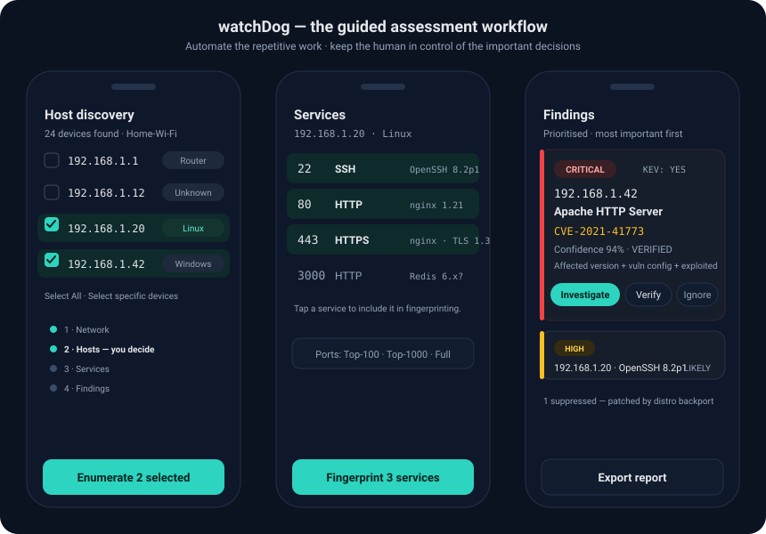

# watchDog

A guided, pentester-style network security assessment tool for Android, with a
correlation backend. Discover the network → discover hosts → enumerate services
→ fingerprint → correlate against vulnerability intelligence → prioritize → you
decide → safe verification.

**Core principle:** automate the repetitive work, keep the human in control of
important decisions.

## Preview



*Design mockup of the guided workflow. The app now performs real scanning end to
end (non-root): live network context, host discovery, port enumeration,
fingerprinting, and CVE correlation — see below.*

## Architecture in one line

The **phone does 100% of network I/O** (discovery, enumeration, fingerprinting,
and verification execution). The **backend never connects to a target** — it is a
pure brain (correlation, prioritization, the vuln DB, and serving signed
check-definitions the phone runs locally). This eliminates backend SSRF by
construction.

See the full plan: `~/.claude/plans/i-want-you-to-shimmying-bird.md`.

## Repository layout

```
watchDog/
  backend/     TypeScript vulnerability-correlation engine (the brain).
               Pure, dependency-free core; deploys into the Website's API routes.
  android/     Gradle workspace (the hands) with three modules:
    core/      Pure Kotlin/JVM library: scanning, correlation, WPA parsing,
               device probes — no Android deps. Shared by both apps.
    app/       Android app (Kotlin + Jetpack Compose). Depends on :core.
    desktop/   Compose-for-Desktop app for Windows/Linux. Depends on :core.
  .github/     CI (backend tests, Android APK, desktop build) + release pipeline.
```

The scanning/correlation logic lives once in `:core` and runs unchanged on
Android, Windows, and Linux. Only the platform edges differ (network context,
mDNS, persistence, UI); see `docs/superpowers/specs/` for the design.

## backend/

The correlation engine turns observed services into ranked, de-duplicated
findings with explicit confidence states:

`DETECTED → LIKELY_VULNERABLE → VERIFIED → EXPLOITABLE`

Key false-positive defenses (the hard part of this domain):

- **CVE-List-first**, not NVD-first (NVD stopped enriching most CVEs in 2026).
- **Distro backport suppression** — a real `dpkg` version comparator so that a
  banner like `OpenSSH_8.2p1 Ubuntu-4ubuntu0.11` is correctly judged *patched*
  by the distro even though upstream `8.2p1` looks vulnerable.
- Version-only matches never rank above `LIKELY_VULNERABLE`.
- CVSS chosen by provenance (v4 > v3.1, CNA > NVD) and **never averaged**.
- KEV + EPSS drive prioritization so range-match noise doesn't drown signal.

### Develop

```bash
cd backend
npm install
npm test        # node --test over the golden-set + version-comparator suites
npm run typecheck
```

Runs on Node ≥ 23.6 via native TypeScript type-stripping (no build step).

## android/

Kotlin + Jetpack Compose app (the "hands" — does all network I/O). Open the
`android/` folder in Android Studio; on first sync it generates the Gradle
wrapper jar (not committed). AGP 8.7 / Gradle 8.10.2 / Kotlin 2.0 / JDK 17,
`minSdk 26`, `compileSdk 35`.

**What the app does (non-root MVP):**

1. **Networks** — shows the currently-joined Wi-Fi as *scannable* (real
   SSID + subnet from `ConnectivityManager`) and other nearby APs as
   *unscannable unless you join them* (Android gives no L3 route to a network
   you haven't joined).
2. **Scope** — *scan the whole network* or *pick a specific host*, with a
   Top-100 / Top-1000 / All-ports depth chooser.
3. **Discovery** — merges TCP-connect probing, best-effort ICMP, and mDNS
   (`NsdManager`) into a live host list.
4. **Enumeration + fingerprinting** — bounded-concurrency connect scan, then
   banner / HTTP (OkHttp) / TLS-cert probes → normalized `{product, version,
   distro}`.
5. **Background execution** — a `connectedDevice` foreground service runs the
   deep scan with a live progress notification and a "scan complete" notification.
6. **CVE correlation** — on-device via OSV.dev + CISA KEV + EPSS (default), run
   through a Kotlin port of the backend engine so states/scores match the
   contract; or POST to your own backend (Settings → own-server URL).

Correlation logic (`correlate/engine/`) is a semantics-preserving port of the
backend's `version.ts` / `match.ts` / `correlate.ts`, validated in
`app/src/test/` against the same golden set. Run the JVM unit tests with
`gradle testDebugUnitTest`.

**Honest limits (by design):** you can only scan the network you're joined to;
bare upstream products (no distro tag) get lower-confidence OSV matches until
own-server mode points at an NVD-CPE index; SYN/ARP/MAC/OS-detection remain a
future root tier.

## desktop/ (Windows & Linux)

A Compose-for-Desktop GUI that reuses the `:core` engine (not Kotlin
Multiplatform — a plain Kotlin/JVM module with the JetBrains Compose plugin).
It runs the NetScan flow end to end: detect the joined LAN, discover live hosts,
select targets, port-scan + fingerprint, and correlate against OSV/KEV/EPSS.

```bash
cd android
gradle :desktop:run                 # launch the desktop GUI
gradle :desktop:runHeadless             # CLI scan of the current subnet
gradle :desktop:runHeadless --args="--list"        # list scannable adapters
gradle :desktop:runHeadless --args="--iface=wlan0 --correlate"   # pick adapter + correlate
gradle :desktop:createDistributable                # portable app image (bundled runtime)
gradle :desktop:packageDistributionForCurrentOS    # native installer: .msi (Windows) / .deb (Linux)
```

The desktop app covers **NetScan** (discovery, enumeration, fingerprinting,
correlation), **Device Watch**, the **WPA Handshake** tool (import, submit to
WPA-sec, track cracked results), **scan history**, and **settings** — the same
core engine as Android. When several adapters are active (Wi-Fi plus Ethernet, or
a second USB Wi-Fi dongle) an adapter picker chooses which one to scan on. Live
WPA capture stays Android-only (it needs monitor-mode hardware). Tagged releases
attach a portable desktop zip for Windows and Linux alongside the APK.

## Releases

CI runs the backend tests, the Android JVM unit tests, and builds the APK on
every push to `main` (`.github/workflows/ci.yml`). To publish an installable
APK, push a version tag:

```bash
git tag v0.1.0
git push origin v0.1.0
```

`.github/workflows/release.yml` then builds the APK, names it
`watchDog-<version>.apk`, and attaches it to an auto-created GitHub Release with
generated notes. `versionName` comes from the tag; `versionCode` from the run
number.

The APK is **debug-signed** — installable by sideloading, which is the intended
distribution channel for this tool. To ship a properly release-signed build
later, add a keystore + signing secrets and switch the release job to
`assembleRelease`.

## Support

If watchDog is useful to you, you can support its development:

<a href="https://buymeacoffee.com/shreyasmahajann" target="_blank">☕ Buy Me a Coffee</a>

## License

Released under the [MIT License](LICENSE) — © 2026 Shreyas Mahajan.
